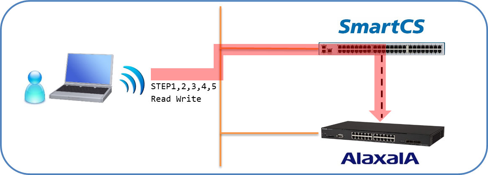
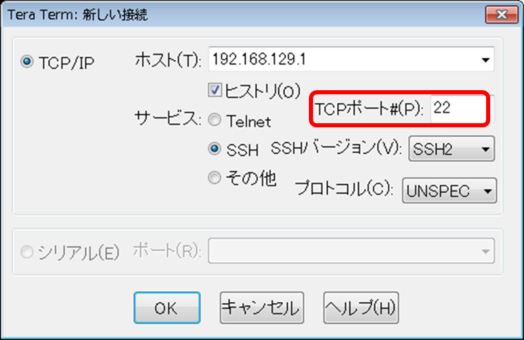

[↑目次に戻る](./README.md)
<br>
# 演習2.1　SmartCSを介してALAXALA装置へコンソールアクセスする
演習2.1では、SmartCSを介してALAXALA装置へのコンソールアクセスを行います。
<br>
TeratermなどのターミナルソフトからSmartCSへの接続時に、SmartCSの各シリアルポートに割り当てられたTCPポートを指定して
アクセスするダイレクトモードを使用します
<br>
<br>

> 注意  
SmartCS経由でALAXALA装置にコンソールアクセスをする場合、使用するターミナルソフトによっては意図しない文字列が出力される場合があります。  
例  
```
login: [48;1H
```
> 出力されてしまった場合、`BackSpace`などで不要な出力(上記例の場合)`[48;1H` を削除後に手順に記載されているオペレーションを行ってください。  

<br>
<br>

## 目次
本演習では以下を行います。
- STEP1. SmartCSのポートサーバーへノーマルモード(RW)でログインする
- STEP2. SmartCSを介してALAXALA装置へログインする
- STEP3. ALAXALA装置に対してコマンドを実行する
- STEP4. ALAXALA装置からログアウトする
- STEP5. SmartCSのシリアルセッションを終了する

## 演習構成図




<br>
<br>

### STEP1. SmartCSのポートサーバーへノーマルモード(RW)でログインする
ダイレクトモード、かつノーマルモード(RW)でSmartCSのポートサーバーへ接続し、ポートユーザでログインします。  
まず、Teratermなどのターミナルソフトを使用して、SSHでSmartCSへ接続します。  
このとき、SSH、ダイレクトモード、かつノーマルモード(RW)でのアクセスなので、シリアルポート1に割り当てられているTCPポート番号:83xxを指定します。  
※ユーザ#1とユーザ#6の場合は8301となります。    
※演習1.1に記載の使用するtty情報を参考に、83xxというポート番号を指定してください。  


ポートユーザの認証には、ログインID（port01）、パスワード(secret01)を入力してログインします。  
※ユーザ#1の場合はport01/secret01となります。  
※演習1.1に記載のポートアクセス用ID/Passを参考に、ユーザ/パスワードを入力してください。  
ログインに成功すると、以下のようなポートサーバーメニューが表示されます。  

```
-- RW1 ------------------------
Host  : "NS-2250_Ansible_1"
Label : "AX-2230_1"
-------------------------------
1  : display Port Log
2  : display Port Log (LAST)
3  : start tty connection
4  : close telnet/ssh session
5  : show all commands
tty-1:rw>
```

<br>
<br>


### STEP2. SmartCSを介してALAXALA装置へログインする
ポートサーバーメニューからシリアルセッションを開始し、ALAXALA装置へログインを行います。
<br>
まず、<code>3  : start tty connection</code>を選択し、シリアルセッションを開始します。
<br>
続けてログインID（operator）を入力するとALAXALA装置にログインすることができます。
<br>

```
-- RW1 ------------------------
Host  : "NS-2250_Ansible_1"
Label : "AX-2230_1"
-------------------------------
1  : display Port Log
2  : display Port Log (LAST)
3  : start tty connection
4  : close telnet/ssh session
5  : show all commands
tty-1:rw> 3
Press "CTRL-A" to return this MENU.
Start tty connection
operator

Copyright (c) 2012-2019 ALAXALA Networks Corporation. All rights reserved.

> 
```

<br>
<br>


### STEP3. ALAXALA装置に対してコマンドを実行する
ALAXALA装置にログイン後、コマンドを実行します。
<br>
<code>></code>というプロンプトが表示されたら、<code>show version</code>コマンドを実行します。
<br>
※演習4.3でF/Wバージョンアップを行うので、<code>S/W: OS-LT4 Ver. 2.9 (Build:04)</code>となっている事を確認してください。
<br>

```
> show version

Date 1980/04/10 03:41:23 UTC
Model: AX2230S-24T
S/W: OS-LT4 Ver. 2.9 (Build:04)
H/W: AX-2230-24T-B [CA022B24T000S0000C7S013:0]

> 
```

ソフトウェアバージョンを確認したら、<code>enable</code>コマンドで管理者権限へ移行し<code>show running-config</code>を実行します。
<br>
IPアドレスやユーザなどの設定がされておらず、工場出荷状態であることを確認します。
<br>

```
> enable
# 
# show running-config
#configuration list for AX2230S-24T
!
vlan 1
  name "VLAN0001"
!
interface gigabitethernet 0/1
  switchport mode access
!
interface gigabitethernet 0/2
  switchport mode access
!
～(省略)～
!
interface gigabitethernet 0/27
  switchport mode access
!
interface gigabitethernet 0/28
  switchport mode access
!
interface vlan 1
!
# 
```

<br>
<br>


### STEP4. ALAXALA装置からログアウトする
オペレーションが完了したら、コンソールを初期状態に戻すためにログアウトを行います。
<br>
<code>exit</code>コマンドを実行してALAXALA装置からログアウトします。
<br>

```
# exit

login: 
```


### STEP5. SmartCSのシリアルセッションを終了する
ログアウト後はSmartCSを介したシリアルセッションを終了させます。
<br>
ALAXALA装置からのログアウトが完了したら、Ctrl+Aを入力してポートサーバーメニューに戻ります。
<br>
その後、<code>4  : close telnet/ssh session</code>を選択して終了します。
<br>

```
login: 
-- RW1 ------------------------
Host  : "NS-2250_Ansible_1"
Label : "AX-2230_1"
-------------------------------
1  : display Port Log
2  : display Port Log (LAST)
3  : start tty connection
4  : close telnet/ssh session
5  : show all commands
tty-1:rw> 4
```

<br>
<br>


### 参考情報1. シリアルポートアクセス用のTCPポート番号
SmartCSのシリアルポートへの各アクセス方法において、シリアルポートに割り当てられているTCPポート番号は下記の通りです。

| 接続モード | プロトコル | セッション種別 | TCPポート |
| --- | --- | --- | --- |
| ダイレクトモード | Telnet | ノーマルモード(RW) | 8101～8148 |
| ダイレクトモード | Telnet | モニターモード(RO) | 8201～8248 |
| ダイレクトモード | SSH | ノーマルモード(RW) | 8301～8348 |
| ダイレクトモード | SSH | モニターモード(RO) | 8401～8448 |
| セレクトモード | Telnet | ノーマルモード(RW) | 23 |
| セレクトモード | Telnet | モニターモード(RO) | 23 |
| セレクトモード | SSH | ノーマルモード(RW) | 22 |
| セレクトモード | SSH | モニターモード(RO) | 22 |

<br>
<br>


### 参考情報2. セレクトモード
本ハンズオンではダイレクトモードでALAXALA装置にアクセスを行いますが、SmartCSを介したもう1つのアクセス方法としてセレクトモードがあります。
<br>
セレクトモードではSmartCSの代表ポート(SSHの場合は22)を指定してアクセスし、ポートユーザ認証を行います。



ポートユーザでログインすると、アクセス可能なシリアルポートの一覧(ポートセレクトメニュー)が表示され、ポート番号(tty)を選択してアクセスを行います。
<br>

```
Host : "NS-2250_Ansible_1" 
login from 192.168.127.2
user (port01) Access TTY List
===========================================================================
 tty : Label                                RW     RO
---------------------------------------------------------------------------
   1 : AX-2230_1                              0      0
   2 :                                        0      0
---------------------------------------------------------------------------
Enter tty number to access serial port
 <ttyno>          : connect to serial port RW session ( 1  - 48  )
 <ttyno>r         : connect to serial port RO session ( 1r - 48r )
 l                : show tty list 
 l<ttyno>-<ttyno> : show a part of tty list
 d                : show detail tty list 
 d<ttyno>-<ttyno> : show a part of detail tty list
 h                : help message 
 e                : exit 
===========================================================================
tty> 1
```

1つのシリアルポートへのオペレーションが終了したら、切替文字コード(本ハンズオンでは<code>Ctrl+A</code>ですが、設定により変更可能)を入力することでポートサーバーメニューへ戻り、<code>0  : return Port Select Menu</code>を選択することでポートセレクトメニューへ戻ることができます。
<br>
新たにターミナルを立ち上げ直すことなく、別のシリアルポートへアクセスを切り替えることが可能となります。
<br>

```
> exit

login: 
-- RW1 ------------------------
Host  : "NS-2250_Ansible_1"
Label : "AX-2230_1"
-------------------------------
0  : return Port Select Menu
1  : display Port Log
2  : display Port Log (LAST)
3  : start tty connection
4  : close telnet/ssh session
5  : show all commands
tty-1:rw> 0
return Port Select Menu

Host : "NS-2250_Ansible_1" 
login from 192.168.127.2
user (port01) Access TTY List
===========================================================================
 tty : Label                                RW     RO
---------------------------------------------------------------------------
   1 : AX-2230_1                              0      0
   2 :                                        0      0
---------------------------------------------------------------------------
Enter tty number to access serial port
 <ttyno>          : connect to serial port RW session ( 1  - 48  )
 <ttyno>r         : connect to serial port RO session ( 1r - 48r )
 l                : show tty list 
 l<ttyno>-<ttyno> : show a part of tty list
 d                : show detail tty list 
 d<ttyno>-<ttyno> : show a part of detail tty list
 h                : help message 
 e                : exit 
===========================================================================
tty> 2
```

<br>
<br>


### 参考情報3. ポートログの確認
SmartCSを介した操作による入出力情報、およびシリアル接続機器から自発的に出力される情報(再起動ログなど)を保存する機能(ポートログ保存機能)があります。
<br>
保存されているポートログは、ポートサーバーメニューで<code>1  : display Port Log</code>を選択して表示することができます。
<br>
また、<code>2  : display Port Log (LAST)</code>を選択すると最新の約5000文字を表示することができます。
<br>

```
-- RW1 ------------------------
Host  : "NS-2250_Ansible_1"
Label : "AX-2230_1"
-------------------------------
1  : display Port Log
2  : display Port Log (LAST)
3  : start tty connection
4  : close telnet/ssh session
5  : show all commands
tty-1:rw> 2

login: operator

Copyright (c) 2012-2019 ALAXALA Networks Corporation. All rights reserved.

> 
> set terminal pager disable
> show version
```


[→演習2.2 SmartCSを介したALAXALA装置へのコンソールアクセスを、別セッションでミラーリングする](/2.2-mirroring_operation_of_smartcs.md)  
[↑目次に戻る](./README.md)
