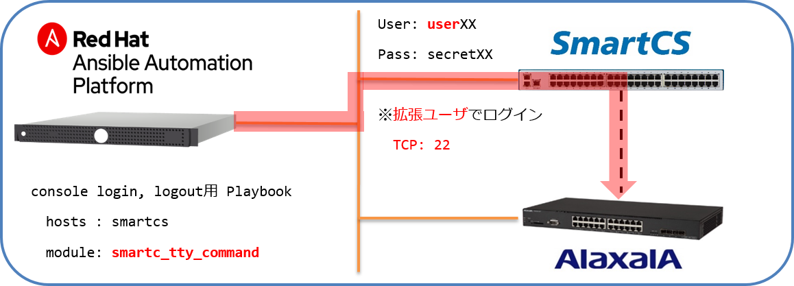

[↑目次に戻る](./README.md)
<br>
# 演習3.4　ALAXALA装置の設定情報をSmartCS経由で取得する

演習3.3でax_commandを使ってALAXALA装置から設定情報を取得するPlaybookを作成しました。    
作成したPlaybookの内容を一部変更して、SmartCS経由（コンソール経由）で同様の情報を取得するPlaybookを作成します。

## 目次
本演習では以下を行います。  
- STEP1.ログイン用、ログアウト用のPlaybookを作成する  
- STEP2.<code>ax_command</code>をSmartCS経由で動作させるように変更する
- STEP3.作成した3つのPlaybookを1回のコマンドで実行する 


### STEP1. ログイン用、ログアウト用のPlaybookを作成する。

通常のモジュール(ax_command等)は、SSH経由で装置にログインして情報を取得しますが、コンソール経由で接続をする場合  
- コンソールからのログイン  
- コンソールからのログアウト  
の処理を行う必要があります。

演習3.1で使った<code>smartcs_tty_command</code>を利用してPlaybookを作成します。

<br>

■演習環境



<br>

■Playbookの編集箇所

| vars | Playbook例の値 | 備考 | 
|:---|:---|:---|
| tty_no |'1' | ユーザ毎に割り当てられているSmartCSの**tty**番号を指定します |

<br>


コンソール経由でのオペレーションは以下のような入出力となります。  
ログイン時
```
login: alaxala
Password:

Copyright (c) 2012-2019 ALAXALA Networks Corporation. All rights reserved.

AX2230>
```
ログアウト時
```
AX2230> exit

login:
```

Playbookは以下のような内容となります。  

■Playbook  
(console_login.yml)
```yaml
---
- name: Login from Console using SmartCS
  hosts: smartcs
  gather_facts: no
  
  vars:
  ### Variables that NEED to Change ###
  - tty_no: '1'
  
  ### Variables that should NOT change ###
  - ansible_connection: network_cli
  - ansible_network_os: smartcs
  - ansible_command_timeout: 60

  tasks:
  - name: login ax2230
    smartcs_tty_command:
      tty: '{{ tty_no }}'
      recvchar:
      - 'login: '
      - 'Password: '
      - 'AX2230>'
      sendchar:
      - 'alaxala'
      - 'secret2230'
```

(console_logout.yml)
```yaml
---
- name: Login from Console using SmartCS
  hosts: smartcs
  gather_facts: no
  
  vars:
  ### Variables that NEED to Change ###
  - tty_no: '1'
  
  ### Variables that should NOT change ###
  - ansible_connection: network_cli
  - ansible_network_os: smartcs
  - ansible_command_timeout: 60

  tasks:
  - name: logout ax2230
    smartcs_tty_command:
      tty: '{{ tty_no }}'
      recvchar:
      - 'login: '
      sendchar:
      - 'exit'
```

<br>
<br>

### STEP2. ax_commandをSmartCS経由で動作させるように変更する

実際の処理部分のPlaybookを作成します。  
演習3.3の<code>ax_command</code>とtask部分は同じですが、<code>hosts</code>と<code>vars</code>に指定する値が変わります。

<br>

■演習環境


<br>

■Playbookの編集箇所

|vars |Playbook例の値 |備考 | 
|:---|:---|:---|
|ansible_user |'port01' |SmartCSの**ポートユーザ ID**を指定します |
|ansible_password |'secret01' |SmartCSの**ポートユーザ Password**を指定します |
|ansible_port |9301 |SmartCSの**Ansibleアクセス用 TCPポート**を指定します |

<br>


■Playbook(console_gathering_ax_information.yml)  
```yaml
---
- name: gathering ax informataion from console using SmartCS
  hosts: smartcs
  gather_facts: no

  vars:
  ### Variables that NEED to Change ###
  - ansible_user: 'port01'
  - ansible_password: 'secret01'
  - ansible_port: 9301

  ### Variables that should NOT change ###
  - ansible_connection: network_cli
  - ansible_network_os: ax
  - ansible_become: yes
  - ansible_become_method: enable
  - ansible_become_pass: 'secret2230'

  tasks:
  - name: show commands
    ax_command:
      commands:
        - show version
        - show system
        - show interfaces gigabitethernet 0/1
        - show ip interface
        - show vlan 
        - show access-filter
        - show ntp-client
        - show running-config
    register: result
  
  - name: show command output
    debug:
      msg:
        - '{{ result.stdout_lines[0] }}'
```
■Playbook内容の説明  
- <code>hosts: smartcs</code>  
SmartCS経由で接続を行うため、接続先をsmartcsと設定します。  
- <code>ansible_user: port01</code>  
SmartCS経由で接続を行うため、ログインユーザを設定します。 
ユーザごとに異なりますので、Playbook作成時にvarsに記載のansible_userの値を変更してください。 
- <code>ansible_password: secret01</code>  
SmartCS経由で接続を行うため、ログインユーザのパスワードを設定します。  
ユーザごとに異なりますので、Playbook作成時にvarsに記載のansible_passwordの値を変更してください。 
- <code>ansible_port: 9301</code>  
SmartCS経由で接続を行うため、ポート番号を指定します。  
ユーザごとに異なりますので、Playbook作成時にvarsに記載のansible_portの値を変更してください。 
- <code>ansible_connection: network_cli</code>  
SmartCS経由でコンソールアクセスを行う場合、コネクションプラグインとして<code>network_cli</code>をサポートしている必要があります。


<br>
<br>


### STEP3. 作成した3つのPlaybookを1回のコマンドで実行する 

STEP1、STEP2 で作成した3つのPlaybookを1回のコマンドで実行できるようなPlaybookを作成します。  
複数のPlaybookを集約して実行する際は、<code>import_playbook</code>を利用します。
https://docs.ansible.com/ansible/latest/modules/import_playbook_module.html

■Playbook(gathering_ax_information_via-console.yml)
```yaml
---
- name: login by console
  import_playbook: console_login.yml

- name: gathering ax information
  import_playbook: console_gathering_ax_information.yml

- name: logout by console
  import_playbook: console_logout.yml
```

■実行例
```
$ ansible-playbook -vvv gathering_ax_information_via-console.yml 
```

■実行結果例
```
PLAY [Login from Console using SmartCS] ******************************************************************

TASK [login ax2230] **************************************************************************************
ok: [smartcs]

PLAY [gathering ax informataion from console using SmartCS] **********************************************

TASK [show commands] *************************************************************************************
ok: [smartcs]

TASK [show command output] *******************************************************************************
ok: [smartcs] => {
    "msg": [
        [
            "Date 1980/05/02 05:31:23 UTC",
            "Model: AX2230S-24T",
            "S/W: OS-LT4 Ver. 2.9 (Build:04)",
            "H/W: AX-2230-24T-B [CA022B24T000S0000C7S013:0]"
        ]
    ]
}

PLAY [Login from Console using SmartCS] ******************************************************************

TASK [logout ax2230] *************************************************************************************
ok: [smartcs]

PLAY RECAP ***********************************************************************************************
smartcs                    : ok=4    changed=0    unreachable=0    failed=0    skipped=0    rescued=0    ignored=0   
```

SmartCS経由で`ax_command`を実行し、ALAXALA装置のコマンド実行結果を取得することができました。  
ベンダーモジュールをSmartCS経由で動作させる場合、以下の変更をするだけでPlaybookを再利用する事が可能です。
- `hosts`を`ax`から`smartcs`に変更
- `vars`の`ansible_user`、`ansible_password`、`ansible_port`を追記

<br>
<br>


## 演習3のまとめ

- <code>smartcs_tty_command</code>を使い、送受信する文字列を指定してコンソールアクセスをする方法  
- <code>ax_command</code>など、他ベンダーのモジュールを利用してSmartCS経由でPlaybookを実行する方法  
についての演習を行いました。  

AnsibleとSmartCSを連携してコンソールアクセスを行う方法としては上記の通り２パターンありますが、  
それぞれ一長一短があります。  

|| <code>smartcs_tty_command</code>を使う場合 | 他ベンダーモジュールとSmartCSを連携する場合 |
|:---|:---|:---|
|〇 |ベンダー製のモジュールの無いネットワーク機器にコンソール経由でアクセスすることが可能 |ベンダー製モジュールを使ったPlaybookの一部パラメータを変更する事でタスク部分は再利用が可能。|
|△ |コンソールの入出力情報がないと、Playbook作成ができない。冪等性の担保がない。 |<code>network_cli</code>コネクションプラグインをサポートしていないと使えない。処理時間がSSH経由と比較して長い |

ターゲットとなるネットワーク機器のベンダーモジュールがあり、コネクションプラグインとして<code>network_cli</code>をサポートしてる場合は、Playbookの再利用性などを考え、他ベンダーモジュールとSmartCSを連携して使う方法が望ましいです。

<code>smartcs_tty_command</code>を使うシチュエーションとして適切なのは以下のような場合となります。  
- ベンダー製モジュールが無いネットワーク機器にアクセスしたい場合  
- ベンダー製モジュールがあるが、<code>network_cli</code>プラグインのサポートないネットワーク機器にアクセスしたい場合
- 既存のモジュールを使ったオペレーションが難しい場合（再起動処理が含まれる手順など）

<br>
<br>

[→演習4.1 オペミスからの復旧自動化](./4.1-automation_of_operation_error_recovery.md)  
[←演習3.3 ALAXALA装置の設定情報を取得する](./3.3-get_alaxala_device_information.md)   
[↑目次に戻る](./README.md)
