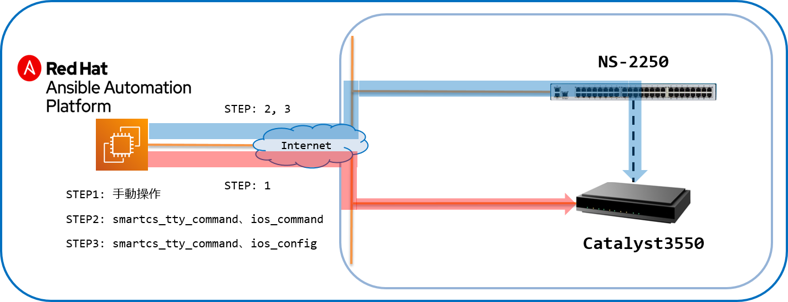
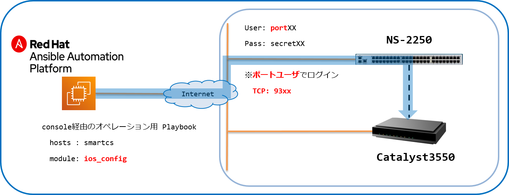

[↑目次に戻る](./README.md)
<br>
# 演習4.2　通信障害からの復旧自動化

演習4.2は演習4.1と同様、通信障害に見立てた、オペレーションミスを人為的に発生させ復旧作業の演習を行います。

## 目次
本演習では以下を行います。  
- [Step 1. 手動で通信障害を想定したオペレーションミスを起こす](./4.2-automation_of_recovery_from_network_communication_failures.md#step-1-手動で通信障害を想定したオペレーションミスを起こす)
- [Step 2. コンソール（SmartCS）経由で設定情報を取得する](./4.2-automation_of_recovery_from_network_communication_failures.md#step-2-コンソールSmartCS経由で設定情報を取得する)
- [Step 3. コンソール（SmartCS）経由で設定を復旧させる](./4.2-automation_of_recovery_from_network_communication_failures.md#step-3-コンソールSmartCS経由で設定を復旧させる)

<br>
<br>

## 演習構成図



<br>
<br>

### Step 1. 手動で通信障害を想定したオペレーションミスを起こす

`vlan 1`のインターフェースである`fastethernet 0/1`がなんらかの原因でDownした事を想定し、人為的にインターフェースをダウンさせます。  

■演習環境


<br>


```
Cat3550>enable
Password:
Cat3550#configure terminal
Enter configuration commands, one per line.  End with CNTL/Z.
Cat3550(config)#interface FastEthernet 0/1
Cat3550(config-if)#shutdown
Cat3550(config-if)#
*Mar  6 21:21:00.556: %LINEPROTO-5-UPDOWN: Line protocol on Interface Vlan1, changed state to down
*Mar  6 21:21:01.472: %LINK-5-CHANGED: Interface FastEthernet0/1, changed state to administratively down
*Mar  6 21:21:02.472: %LINEPROTO-5-UPDOWN: Line protocol on Interface FastEthernet0/1, changed state to down
Cat3550(config-if)#
```
- コンソール経由、SSH経由のどちらでオペレーションを行っても大丈夫です。  
- コンソール経由で行った場合、<code>exit</code>コマンドを実行して、状態を<code>login: </code>に戻しておいてください。

演習4.1と同様、IPリーチできない状態となりました。

<br>
<br>

### Step 2. コンソール（SmartCS）経由で設定情報を取得する

演習4.1 STEP3 で作成した<code>gathering_config.yml</code>を実行し、コンソール経由で設定情報の取得をおこないます。


<br>

STEPでIOS装置へのSSH接続が切れた際に、ターミナルを閉じて再度EC2へSSH接続した場合は、  
次のコマンドを実行して、python仮想環境を有効化してください。  

```bash
source ~/ansible-handson/bin/activate
cd ~/ansible-handson/exercise_4
```

プロンプトの先頭が<code>(ansible-handson)</code>となっていることを確認してください。
```bash
[ec2-user@ip-172-26-10-114 ~]$ source ~/ansible-handson/bin/activate
(ansible-handson)[ec2-user@ip-172-26-10-114 ~]$ cd ~/ansible-handson/exercise_4
(ansible-handson)[ec2-user@ip-172-26-10-114 exercise_4]$
```
  
python仮想環境を有効化されている状態で、<code>gathering_config.yml</code>を実行します。  

■実行例
```
ansible-playbook gathering_config.yml -vvv
```

■実行結果
```
show ip interface 抜粋

FastEthernet0/1 is administratively down, line protocol is down
  Inbound  access list is not set
```

FastEthernet0/1がダウン状態である事が分かりました。  

<br>
<br>

### Step 3. コンソール（SmartCS）経由で設定を復旧させる

対象のインターフェースとなる<code>fastethernet 0/1</code>をアップさせます。

演習3.1で行った初期構築時の手順をPlaybook化します。

<br>

■演習環境



<br>


■Playbook(console_init-setting_ansible-reach.yml)

次のコマンドを実施し、ファイルを作成しましょう。<br>

```bash
vi console_init-setting_ansible-reach.yml
```
実行すると、console_init-setting_ansible-reach.ymlというファイルが作成され、エディタ画面が表示されます。<br>
次に、**iキー**を押して **Insertモード** (挿入モード)に変更してください。<br>
モードが変更されたこと確認し(左下にモード名が表示されます)、下記の内容をエディタで記載してください。<br>
> 今回は、コピー＆ペーストでの実施をお勧めします。<br>

(console_init-setting_ansible-reach.yml)
```yaml
---
- name: set initial configuration from console using SmartCS
  hosts: ios_sshxpt
  gather_facts: no

  vars:
  - ios_ipaddr: "{{ hostvars['ios']['ansible_host'] }}"
  - ios_subnet: '255.255.255.0'

  tasks:
  - name: set ipaddr to intarface vlan 1
    cisco.ios.ios_config:
      lines:
        - ip address {{ ios_ipaddr }} {{ ios_subnet }}
        - no shutdown
      parents: interface vlan 1
      save_when: changed

  - name: interface up
    cisco.ios.ios_config:
      lines:
        - no shutdown
      parents: interface fastethernet 0/1
      save_when: changed

  - name: enable ssh
    cisco.ios.ios_config:
      lines:
        - login local
        - transport input ssh
      parents: line vty 0 1
      save_when: changed
```
入力が終わったら、[esc]キーを押して、Insertモードから抜けてください。<br>
モードが変更されたことを確認し、:wq と入力して（左下に:wqと表示されます。）、[Enter]キーを押してください。<br>
以上で、ファイルを保存し、エディターを終了します。<br>


■Playbook(init-setting_ansible-reach.yml) 

次のコマンドを実施し、ファイルを作成しましょう。<br>

```bash
vi init-setting_ansible-reach.yml
```
実行すると、init-setting_ansible-reach.ymlというファイルが作成され、エディタ画面が表示されます。<br>
次に、**iキー**を押して **Insertモード** (挿入モード)に変更してください。<br>
モードが変更されたこと確認し(左下にモード名が表示されます)、下記の内容をエディタで記載してください。<br>
> 今回は、コピー＆ペーストでの実施をお勧めします。<br>

(init-setting_ansible-reach.yml)  
```yaml
---
- name: login by console
  import_playbook: console_login.yml

- name: init-setting (ansible-reach)
  import_playbook: console_init-setting_ansible-reach.yml

- name: logout by console
  import_playbook: console_logout.yml
```
入力が終わったら、[esc]キーを押して、Insertモードから抜けてください。<br>
モードが変更されたことを確認し、:wq と入力して（左下に:wqと表示されます。）、[Enter]キーを押してください。<br>
以上で、ファイルを保存し、エディターを終了します。<br>

■実行例
```
ansible-playbook init-setting_ansible-reach.yml 
```


■実行結果例
```
PLAY [Login from Console using SmartCS] *****************************************************************************

TASK [login cat3550] ************************************************************************************************
ok: [smartcs]

PLAY [set initial configuration from console using SmartCS] *********************************************************

TASK [set ipaddr to intarface vlan 1] *******************************************************************************
changed: [ios_sshxpt]

TASK [interface up] *************************************************************************************************
changed: [ios_sshxpt]

TASK [enable ssh] ***************************************************************************************************
ok: [ios_sshxpt]

PLAY [Logout from Console using SmartCS] ****************************************************************************

TASK [logout cat3550] ***********************************************************************************************
ok: [smartcs]

PLAY RECAP **********************************************************************************************************
ios_sshxpt                 : ok=3    changed=2    unreachable=0    failed=0    skipped=0    rescued=0    ignored=0
smartcs                    : ok=2    changed=0    unreachable=0    failed=0    skipped=0    rescued=0    ignored=0 
```

IPリーチできる事を確認します。

IOS装置にログインできるかどうかを認してみます。
```
$ ping -c 3 cisco
PING cisco (192.168.128.1) 56(84) bytes of data.
64 bytes from cisco (192.168.128.1): icmp_seq=1 ttl=64 time=1.05 ms
64 bytes from cisco (192.168.128.1): icmp_seq=2 ttl=64 time=1.00 ms
64 bytes from cisco (192.168.128.1): icmp_seq=3 ttl=64 time=1.05 ms

--- cisco ping statistics ---
3 packets transmitted, 3 received, 0% packet loss, time 2002ms
rtt min/avg/max/mdev = 1.008/1.039/1.056/0.043 ms
$ 
$ ssh cisco@cisco
cisco@cisco's password: 

Cat3550>
```
無事アクセスできるようになりました。

<br>
<br>

## 演習4.2のまとめ

- 通信障害が発生した場合、ネットワーク経由で装置にログインする事が難しくなりトラブルシュートに取り掛かるまでの時間が掛かってしまう場合がありますが、SmartCSをAnsibleを組み合わせることで、情報収集や復旧の手順を自動化する事ができます。  
- 通常IP設定やインターフェースのUP/DOWNといったオペレーションはAnsible経由で行う事ができませんが、SmartCSと連携する事でこれらのオペレーションも実行する事ができます。

<br>
<br>

[→演習4.3 初期化の自動化](./4.3-automation_of_initialization.md)  
[←演習4.1 オペミスからの復旧自動化](./4.1-automation_of_operation_error_recovery.md)  
[↑目次に戻る](./README.md)
